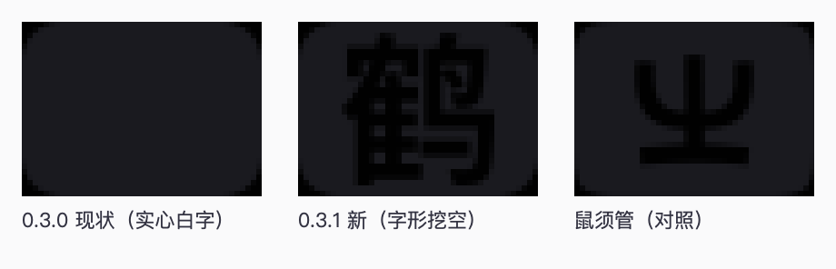
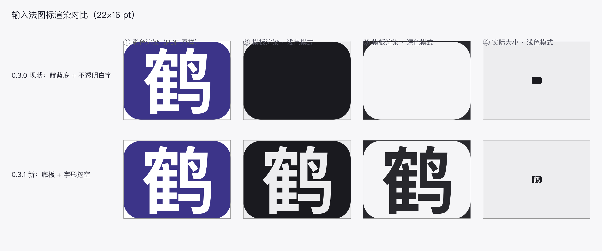
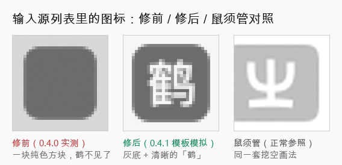
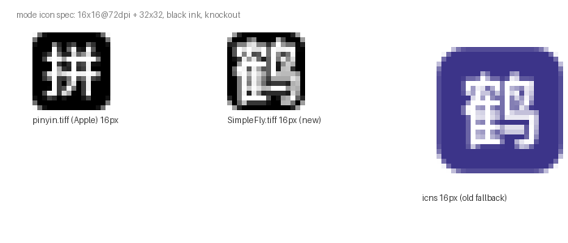

# SimpleFly · macOS 小鹤输入法

一个**最小可用**的 macOS 输入法：自家实现的输入引擎 + InputMethodKit 前端，支持**小鹤双拼**与**小鹤音形**。
只用 Command Line Tools 里的 `clang` 编译，不需要 Xcode 工程；装在自己家的输入法目录，不做签名、公证、分发。

> [!IMPORTANT]
> **非官方声明**：本项目是第三方实现，与小鹤官方（<https://flypy.cc>）**无关**、未获其授权。
> 「小鹤」「小鹤音形」为权利人商标，此处仅用于指代输入方案。
>
> **本仓库不分发码表** —— 小鹤音形码表版权归小鹤官方所有，官方明确声明「任何第三方内置小鹤音形方案的行为均为侵权」。
> 码表需自行从官方渠道获取，方法见 [§6 码表](#6-码表--重新生成码表)。许可细节见 `LICENSE` 与 `NOTICE`。

> 当前状态：**0.6.0**（build 21），已构建并安装到 `~/Library/Input Methods/SimpleFly.app`，bundle 已被 TextInput 服务接受。
>
> 在系统设置里的显示名是 **`SimpleFly`**，图标是**汉字「飞」的挖空底板**（换字见 §7「图标」）：模式图标 `SimpleFly.tiff` 用 Apple 自家规格（16×16@72dpi + 32×32 双帧 TIFF），菜单栏同样由它提供；另保留 22×16 pt 的 `SimpleFly.pdf`。细节见 §11。
>
> 「装好了但系统设置里看不到」的两个病因都修掉了，排查过程见 §11：
> - **0.1.0** —— `Info.plist` 缺 `ComponentInputModeDict`、bundle id 不是三段式，TIS **静默忽略整个 bundle**
> - **0.2.0** —— `InfoPlist.strings` 的 key 少了 `.SimpleFly` 一段，显示名退化成一串 `com.simplefly.inputmethod.SimpleFly.Hans`，**列表里其实有、只是认不出来**
> - **0.2.2** —— 图标是 128×128 px、72dpi 的 TIFF，逻辑尺寸被当成 **128 pt**（鼠须管只有 22×16 pt），所以显得巨大
> - **0.3.0** —— 候选窗按鼠须管的 `metro` 主题重绘，补上标点输入、中英一键切换、内嵌编码
> - **0.3.1** —— 「图标是一整块黑方块」：菜单栏图标是**模板图渲染**（系统只看 alpha、自己涂成单色），
>   「不透明底 + 不透明白字」会被涂成纯黑一块。改成**底板 + 字形挖空**（和鼠须管、和系统日本语输入法的「あ」同一种画法），见 §11
> - **0.4.0** —— 三项新功能（见 §4）：
>   **自定义快捷输入**（`fmc = 凤满成`，改文本文件即生效）、
>   **方向键选候选**（↑↓←→ 移动高亮，空格/回车/逗号顶屏都跟着走）、
>   **查编码**（`Ctrl+/` 后用拼音查字，候选上直接标出音形码拆分，如「好 hc·nz」）
> - **0.4.1** —— 「输入源列表里图标是一块纯色方块」：同一个挖空问题，这次栽在**应用图标 `.icns`** 上。
>   列表拿不到模式图标时会回退到 app 图标，而它**同样按模板图渲染** → 实心的 `.icns` 被涂成一整块。
>   已把 `.icns` 也改成挖空（与鼠须管的 `RimeIcon.icns` 一致），见 §11
> - **0.4.2** —— 两件事：
>   ①「查编码拼音只出一两个字」：码表里同音字**各带形码**（好=hc、号=hck、浩=hcd、豪=hcw），
>   原来按**精确匹配**查 `hc` 只回得来「好」一个字。改成**前缀匹配**并列出同音一整族
>   （候选窗 3 行 × 9 列网格 + 自动翻页，上限 256），拼音、双拼、中途态都能查。
>   ②「切换菜单里图标比别人的小」：实测我们渲染成 **26×26 px 小方块**（`.icns` 兜底），
>   而 ABC / 鼠须管 / 简体拼音都是 **44×32 px**（22×16 pt PDF 满尺寸）。
>   TIS 本身能解析到我们的 PDF（`IconImageURL` 指向 `SimpleFly.pdf`），差异出在 plist：
>   删掉 Tiger 时代的顶层 `tsInputMethodIconFileKey`（鼠须管没有它），补上 `CFBundleIconName`。见 §11
> - **0.4.3** —— 「查编码」从「查一个字就退」改成**常驻拼音输入法**，对应用户场景
>   「不会按小鹤音形拆字，切拼音输入法把字打出来、直接看编码」：
>   ① `ReverseModeAutoExit` 默认 **YES→NO**，`Ctrl+/` 进入后一直保持拼音模式，可连续打拼音出字（像普通拼音输入法），按 Esc / 再按 `Ctrl+/` 才退；
>   ②上屏后 HUD 短暂显示该字音形码（「好  hc·nz」，1.8s），直接满足「打出来后看编码」。
>   引擎层 `hao`→`hc`→26 候选、控制器 `test_reverse_mode` 均正常，0.4.2 已装好，所以这次是交互模型问题不是旧版本 bug。
> - **0.4.4** —— 「查编码」支持**词语查询**，对应「用拼音查整词、直接看整词编码」的场景：
>   ① 多音节拼音也能查（`nihao` → `nihc` → `你好`），新增 `sf_pinyin_to_double_multi` 把拼音按音节切开逐个转双拼码再拼起来；
>   ② 同前缀下**单字 + 词语都列**：单字排前、词语排后（好 / 号 … 之后跟 好啊 / 好吧），`sf_engine_lookup_prefix` 的 `singles_only` 改成三态（0 都要 / 1 只要单字 / 2 只要词语）。
> - **0.5.0** —— **候选窗配色主题化**：写死的配色宏抽成 `SFCandidateTheme` 运行时对象，
>   内置 `metro`（浅，原配色）/ `dark`（深灰底靛蓝高亮）/ `paper`（暖白纸底橙高亮）；
>   `Ctrl+;` 循环切换（写回 `Theme` 偏好，未知名兜底 metro），切换不清组字状态、正组字时即时重绘；
>   加主题 = `SFCandidateTheme.m` 的 `kThemes` 表加一行 10 色值；`./build.sh --preview` 离线渲染三主题拼图（`docs/主题预览.png`），不用注销重登就能看效果。
> - **0.5.1** —— 「系统设置列表里图标比别人的小」（**真机已验证修好**）：
>   截图实测我们渲染成 **26×26 px 小方块**，像素级比对确认它就是 `.icns` 的 `icon_16x16@2x` 帧 ——
>   即列表**压根没在用模式图标**，一直在回退 app 图标。而 plist 三键、PDF、TIS 的 `iconURL` 全都正确，
>   重新注册也没用 —— 说明 **macOS 26 的设置列表不采用 22×16 的 PDF 模式图标**。
>   正解照抄 Apple：解剖 SCIM.app 的 `pinyin.tiff`（列表里显示正常的「拼」徽标）得到规格 =
>   **双帧 TIFF（16×16@72dpi + 32×32@144dpi）、黑墨 + alpha 模板、满幅圆角底板 + 挖空字形**，
>   照此生成 `SimpleFly.tiff`，三个 `tsInputMode*IconFileKey` 全指向它。
>   **根因与旧结论的差异**：0.4.2 那次是 plist 顶层键导致回退；这次是**文件格式不被列表接受** ——
>   PDF 在菜单栏能用，不代表设置列表会用。见 §11
> - **0.6.0** —— **缺码表时给可见提示**（开源准备的一部分）：本仓库不含码表，clone 之后没放码表
>   就按任何键都毫无反应，而原来只有一行 NSLog —— 最容易被误判成「装坏了」。现在弹 HUD 指名放到
>   哪个目录，并且**不吞键**（字母照常上屏，至少还能当英文键盘用）。
>   同时 `./build.sh --test` 在无码表时不再崩在第 6 套：依赖码表的套件明确跳过，缺表时还会清掉
>   `build/` 里残留的旧表（留着会让测试以为有表，缺表分支永远测不到）。
>
> 八套命令行单测（引擎 / 引擎反查 / 标点 / 拼音键位 / 自定义短语 / 控制器 / 重码记忆 / 简繁转换）**共 485 项全通过**

---

> **面向使用者的说明（安装 / 日常用法 / 配置项）见 [`用户手册.md`](用户手册.md)**，本文是开发者向的实现与排查笔记。

---

## 1. 它是什么 / 不是什么

| | 说明 |
|---|---|
| ✅ 是 | 一个能真正打字的中文输入法：双拼音码查字、音形 4 码定字、四键唯一即上屏、快符与符号 |
| ✅ 是 | 引擎与界面分离：引擎是纯 C，可以脱离输入法在命令行跑单测 |
| ❌ 不是 | 不是 Squirrel 的替代品。它没有整句、没有用户词库、没有翻页、没有简繁转换 |
| ❌ 不是 | 不是能分发的产品：ad-hoc 签名，换台机器会被 Gatekeeper 拦（自用无所谓） |

**为什么砍掉整句**：官方 `flypy.schema.yaml` 里写的是 `translator.enable_sentence: false` —— 小鹤音形本身就不是整句方案，它的输入码是「双拼 + 双形」。所以这不算是功能缺失，而是与官方口径一致。

---

## 2. 快速开始

```bash
cd /path/to/simplefly

./build.sh          # 编译 + 组装 .app + ad-hoc 签名（几秒）
./build/SimpleFly.app/Contents/MacOS/SimpleFly --check   # 自检：码表读得到吗
./install.sh        # 装到 ~/Library/Input Methods/
```

然后：

1. 系统设置 › 键盘 › 文字输入 › 输入法 › 编辑… › `+` › 中文（简体） › **SimpleFly - Flypy**
   （列表里找不到就先注销重登一次；macOS 13+ 首次添加会弹「TextInputMenuAgent 想启用第三方输入法」，**必须点允许**）
2. **想跳过注销**：编译 `tools/tis_diag.c`，跑 `/tmp/tisdiag simplefly --select` —— 直接把它切成当前输入法，实测有效（§11）

卸载：`./uninstall.sh`

---

## 3. 目录结构

```
simplefly/
├── build.sh                     # 用 clang 直接编译并组装 bundle
├── install.sh / uninstall.sh    # 装到 / 从 ~/Library/Input Methods 移除
├── src/
│   ├── engine.h / engine.c      # 纯 C 输入引擎：码表加载 + 前缀查询 + 上屏策略 + 反查索引
│   ├── punctuation.h/.c         # 纯 C 标点表：中文标点 / 英文标点 / 全角 + 成对引号
│   ├── pinyin.h/.c              # 纯 C：全拼 -> 小鹤双拼（键位表，供「查编码」用）
│   ├── phrase.h/.c              # 纯 C：用户自定义快捷输入表（编码 = 内容，热重载）
│   ├── SFInputController.h/.m   # IMK 前端：按键处理、光标定位、提交文本、模式切换
│   ├── SFCandidatePanel.h/.m    # 自绘候选窗（不用 IMKCandidates），metro 主题
│   └── main.m                   # IMKServer 启动 + --check 自检 + 生成短语表示例
├── tools/
│   ├── build_dict.py            # 把 16 个分类的 dict.yaml 合并成单表 TSV
│   ├── engine_test.c            # 引擎测试夹具（--selftest / --bench / 直接查码）
│   ├── reverse_test.c           # 引擎反查单测（词条 -> 编码）
│   ├── punct_test.c             # 标点表单测（逐条对照 Rime punctuation.yaml）
│   ├── pinyin_test.c            # 全拼 -> 双拼键位表单测
│   ├── phrase_test.c            # 自定义短语表单测（含前缀查询 / 热重载）
│   ├── verify_pinyin.py         # 拿码表 + pypinyin 全量校验键位表（需 pypinyin）
│   ├── controller_test.m        # 控制器按键路由单测（假客户端 + 合成 NSEvent）
│   ├── inputsource_list.c       # 诊断：TIS 认不认这个 bundle
│   ├── tis_diag.c               # 诊断：显示名 / invisible / 可否启用 / --select 切换
│   ├── tis_register.c           # 诊断：当场重新注册（改 plist 不用注销）
│   ├── make_icon.m              # 生成图标：模式图标 16/32 双帧 TIFF + 菜单栏 22x16 pt PDF（都挖空）+ 应用用 .icns
│   ├── preview_sheet.m          # 把候选图标按「彩色 / 模板图浅色 / 模板图深色 / 实际大小」并排出表
│   └── tile.m                   # 把候选图标按真机像素（2x 屏）放大排一排，看字认不认得出
└── resources/
    ├── Info.plist               # IMK 必需的几个键都在这里
    ├── SimpleFly.pdf            # 生成物：22x16 pt PDF（字形挖空，见 §11）
    ├── SimpleFly.tiff           # 生成物：模式图标（16x16@72dpi + 32x32 双帧，Apple 同款规格，0.5.1 起）
    ├── SimpleFly.icns           # 生成物：应用图标（CFBundleIconFile 指向它）
    ├── en.lproj/                # InfoPlist.strings：key 必须是完整输入源 ID
    ├── zh-Hans.lproj/
    └── simplefly.dict           # 生成物：76,515 条 / 70,917 个编码
```

---

## 4. 键位与行为（逐条对齐官方 schema）

| 按键 | 行为 | 官方依据 |
|---|---|---|
| `a`–`z` `;` `'` | 累积编码，实时出候选 | `speller.alphabet: "abcdefghijklmnopqrstuvwxyz;'"` |
| `1`–`9` | 上屏第 N 个候选 | 选择器 |
| `空格` | 上屏**当前高亮**那个候选（默认是第一个） | — |
| **`↑` `↓` `←` `→`** | **在候选里移动高亮**（四个键都算一维移动：↑← 往前、↓→ 往后；到两端回绕）。没在组字时照旧放行给应用移动光标 | 鼠须管用 `-` `=` / `[` `]`，但方向键更顺手 |
| `;`（已有候选时） | 上屏**第二个**候选 | `key_binder: {accept: semicolon, send: 2, when: has_menu}` |
| `,` `.` | **顶屏**：先把**当前高亮**那个顶上去，再打出标点 | `{accept: Release+period/comma, …, when: composing}` |
| 第 4 码 | 精确匹配**唯一**时自动上屏 | `speller.auto_select: true` / `auto_select_pattern: ^;.$|^\w{4}$` |
| `Backspace` | 删掉编码最后一位 | — |
| `Esc` / `Tab` | 放弃当前编码（Tab 之后照常把 Tab 送给应用） | `key_binder: {accept: "Tab", send: Escape, when: composing}` |
| `回车` | 有编码时上屏**当前高亮**那个候选 | — |
| 大写字母 | 原样送出（不进编码缓冲，保留大小写） | `ascii_composer`：Shift+字母直接输出 |
| **标点键** | 走标点表：单候选直接上屏，多候选弹窗，引号左右交替 | `punctuator` + `punctuation.yaml` |
| **单敲 `Shift`** | **中 / 英一键切换**（「英文」＝一个键都不拦，全部交给应用） | 官方由 `ascii_composer` 的 `switch_key` 管中英状态；本实现把「单敲 Shift」做成一次显式切换 |
| **`Ctrl` + `.`** | **中英标点切换**（，。 ↔ ,.） | `switches: ascii_punct` |
| **`Shift` + `空格`** | **全 / 半角切换**（全角时空格变全角空格） | `switches: full_shape` |
| **`Ctrl` + `/`** | **查编码模式**开 / 关：输入拼音（或双拼码）查字，候选上标出音形码（详见下） | 官方没有对应物，是本实现为「不会打的字」加的 |

### 标点表覆盖的键

| 键 | 中文标点 | 全角 |
|---|---|---|
| `,` `.` `?` `:` `!` `(` `)` | `，` `。` `？` `：` `！` `（` `）` | 同左 |
| `^` `_` | `……` `——` | 同左 |
| `/` | `、` / `／` / `÷` | `／` `÷` |
| `\` `\|` | `、` `·`… | `、` `·` `｜` `§` `¦` |
| `[` `]` `{` `}` | `「【〔［` / `」】〕］` / `『〖｛` / `』〗｝` | 同左 |
| `<` `>` | `《〈«‹` / `》〉»›` | 同左 |
| `"` `'` | `“”` / `‘’`（**成对，左右交替**） | 同左 |
| `$` `%` `*` `@` `#` … | `￥`… `°` `℃` `×` `※` … | 全套全角 |
| `空格` | 空格原样（空格是上屏键，不进表） | **`　`** 全角空格 |

> 标点数据逐条来自 Rime 官方 `punctuation.yaml` 的 `half_shape` / `full_shape` 两段；
> `ascii_style` 段全是原样输出，所以不建表。**逐条对照在 `tools/punct_test.c` 里以断言形式写死**，
> 以后改表会立刻被测试挡住。

**两条刻意的取舍**：

- **`;` 与 `'` 永远是编码字符**（`speller.alphabet` 含它们），所以不被标点表接管。
  例外只有一个：**缓冲为空时单敲 `'`** 会输出中文左引号 `‘`。
  依据是实测的码表事实 —— 76,515 条里**没有任何一条编码以 `'` 开头**（它只做韵母分隔符，如 `aof'`），
  所以空缓冲下敲 `'` 不可能是「想打编码」。`;` 则相反（有 26 条以 `;` 开头的编码，`;` 本身就映射到 `：`/`；`），
  所以照常走码表。
- **组字中按 `,` `.` 仍是顶屏**，之后才输出标点；按其他标点键则是「先丢掉未完成的编码，再输出标点」。

**与官方的两处有意差异**（都可通过配置改回）：

| 项 | 官方 | 本实现 | 原因 |
|---|---|---|---|
| 前缀补全 | `enable_completion: false` | **默认开** | 自己用时敲了 1–2 码就想看到同音字；不想看就 `EnableCompletion = NO` |
| 四键上屏条件 | 只要码长是 4 | **额外要求精确匹配唯一** | 有重码时把选择权留给人，避免吞掉选字机会 |

### 自动上屏的两条规则（对应官方 `auto_select_pattern`）

官方是 `^;.$|^\w{4}$` —— **两半**，0.5.2 起两半都实现了（此前只有 `^\w{4}$`）：

| 规则 | 例子 | 说明 |
|---|---|---|
| `^\w{4}$` | `aaba` | 四码且**精确匹配唯一**才上屏；有重码留给空格 |
| `^;.$` | `;a` → `！` | 快符打满两码直接上屏，一天省几十次空格 |

⚠️ **单敲 `;` 不会上屏**：码表里 `;` 有 2 个候选（`：` 和 `；`），必须按空格选 ——
`^;.$` 只匹配码长 2，这一点是刻意守住的。

24 个快符的完整表、以及码表里另外三类非汉字内容（`of` 特殊符号 676 个、`oi` emoji 313 个、
`ow` 微信表情名 113 个）见 **`docs/符号速查.md`**（`./build.sh --symbols` 本地生成；属码表衍生内容，不进仓库）。
两类自动上屏统一由 `AutoCommit4` 开关管，关掉则一律空格确认。

### 方向键选候选（0.4.0）

`↑` `↓` `←` `→` 在候选窗里移动高亮，四个键都当**一维移动**（单行候选，上下与左右等价）：

| 操作 | 效果 |
|---|---|
| `→` / `↓` | 高亮往后一个 |
| `←` / `↑` | 高亮往前一个 |
| 两端再按 | **回绕**到另一头（一页最多 9 个候选，按一次反方向就能跳到末尾） |
| `空格` / `回车` / `,` `.` 顶屏 | 上屏的都是**当前高亮**那一个 |
| `1`–`9` | 仍然直接选第 N 个，不受高亮影响 |

**没在组字时方向键照旧放行**给应用去移动光标 —— 只有候选窗开着的时候才被输入法接管。

> 用 `↑`/`↓` 而不是 `-`/`=` 翻页键：一页本来就能放下全部候选（最多 9 个），
> 上下键与左右键等价最好记。真正的翻页（候选多于一页时）还没做，见 §9。

### 用户自定义快捷输入（0.4.0）

把一长串常用内容绑到一个短编码上。配置文件（首次运行会自动生成一份带说明的示例）：

```
~/Library/Application Support/SimpleFly/phrase.txt
```

```ini
# 一行一条，= 或制表符分隔，# 开头是注释
fmc = 凤满成
dz  = 我的常用地址
yx  = you@example.com
sj  = 13900000000
```

| 行为 | 说明 |
|---|---|
| 位置 | 敲完编码后，自定义内容排在候选窗**第一位**，空格或数字键 `1` 上屏 |
| 优先级 | **高于码表**。但这不会顶掉码表原有的候选，只是排在最前 |
| 编码长度 | 任意长（可以超过 4 码），也可以含数字 |
| 生效时机 | **改完文件立即生效**，不用重启输入法（按文件 mtime 自动重载） |
| 不误触发 | 自定义编码即使刚好 4 码，也**不会**被「四键上屏」自动顶出去 —— 要按一下空格确认 |

> **一个不做就会踩的坑**：输入法在「敲到某个前缀、码表里完全没有候选」时会判空码、
> 回退并 beep。自定义 `fmc` 之后敲到 `fm`（码表里恰好也没有 `fm` 的精确匹配）就会触发这个，
> 结果永远打不出 `fmc`。所以短语表额外提供**前缀查询**：只要有编码以当前缓冲开头，就当作「还没打完」。
> 这条有专门的单测（`phrase_test.c` 的前缀用例 + `controller_test.m` 的 `test_custom_phrase`）。

### 查编码（拼音反查，0.4.0 / 0.4.2 改前缀匹配 / 0.4.3 改常驻拼音输入法 / 0.4.4 支持词语查询）

**场景**：遇到一个不会打（不知道形码）的字，但知道它念什么。

```text
Ctrl+/            进入查编码模式（屏幕上提示「查编码：输入拼音」）—— 它是个**常驻拼音输入法**
hao               输入拼音 —— 也可以直接输小鹤双拼码 hc
                  候选窗按 3 行 × 9 列网格列出 hao 音的一整族字（27 个一页，多了自动翻页），
                  每个字后面标出它的音形码：
                      1 好 hc·nz    2 号 hck·nz    3 浩 hcd·nz    4 豪 hcw·nz …
                  中点左边是音码、右边是形码 —— 这就是「编码拆分」
空格              上屏高亮的字；上屏后**不退出**模式，HUD 短暂显示「好  hc·nz」让你记码
ni                接着再打拼音继续出字（像普通拼音输入法一样连着打）
Esc / Ctrl+/      退出查编码模式，回到小鹤双拼
```

| 细节 | 说明 |
|---|---|
| 输入什么 | **全拼**（`hao`）和**小鹤双拼码**（`hc`）都认，用「是不是合法拼音音节」自动区分，不用手动切 |
| **按前缀匹配**（0.4.2） | 同音字在码表里**各带形码**（好=hc、号=hck、浩=hcd、豪=hcw），按精确匹配查 `hc` 只回得来「好」一个字 —— 0.4.1 之前「拼音打进去了候选只有一两个字」就是这个原因。现在列出**所有编码以该读音开头**的候选（`sf_engine_lookup_prefix`，上限 256）：**单字排前、词语排后**（0.4.4 起词语也收，见下） |
| **词语查询**（0.4.4） | 查编码现在也支持整词：① 多音节拼音 `nihao` 经 `sf_pinyin_to_double_multi` 切成 `ni`+`hao` → `nihc`，按该码前缀查到词语 `你好`（附注 `nihc`）；② 同一读音前缀下词语跟在单字后面（`hc` → 好/号… 之后是 好啊/好吧）。`singles_only` 三态：0 单字+词语都要、1 只要单字、2 只要词语 |
| 显示什么 | 每个候选后面跟着该字的完整音形码，音码与形码之间用 `·` 分开 |
| 翻页 | 候选超过一页（27 个）时右上角显示 `1/N`；不用额外按键 —— 方向键移过高亮、越过分页边界就自动翻页 |
| **常驻（0.4.3）** | 默认查到字上屏后**不退出**模式，可连续打拼音出字，就像个拼音输入法；这正是「不会拆字、用拼音把字打出来并看编码」的场景。想回退到旧行为（查一个就退）把 `ReverseModeAutoExit` 设 `YES` |
| 上屏后看编码 | 选中一个字上屏时，HUD 会短暂显示「字  音·形」（如 `好  hc·nz`，约 1.8 秒），方便边打边记码 |
| 退出 | `Esc`（先清缓冲，再按一次退出）或再按 `Ctrl+/` |
| 连查（旧行为） | `defaults write com.simplefly.inputmethod.SimpleFly ReverseModeAutoExit -bool YES` 后，查到一个字上屏就自动退回小鹤 |
| 与英文模式 | 互斥。进入查编码模式会自动退出英文模式（英文模式下输入法一个键都不拦，两者没法共存） |

**全拼 → 双拼**靠的是内置键位表（`src/pinyin.c`），没有外部词库。这张表不是抄的：
`tools/verify_pinyin.py` 拿官方码表里每个单字的音码与该字的真实拼音对照，
**9377 个单字一致率 98.2%**，剩下 154 个不一致全是部首字（`艹宀辶` 这类在码表里走形码 `ob/of`）
与多音生僻字 —— 没有任何一个拼音出现系统性偏差。

> 需要 `pypinyin` 才能重跑那个校验脚本：
> `python3 -m pip install pypinyin && python3 tools/verify_pinyin.py`

### 重码记忆（0.5.3）

**场景**：码表里 4,317 个编码有重码（其中 4,071 个是 2 候选）。同一个码每次都在
「按方向键再空格」和「直接空格赌一把」之间纠结。

现在输入法会记住「这个编码上次选了谁」，下次把它**重排到第一位**——直接空格就是上次选的那个。

```text
hcd        候选：浩 / 号（上次选了「浩」）
空格       直接空格 = 「浩」，不用再按方向键
```

| 边界 | 说明 |
|---|---|
| 只重排、不改高亮 | 高亮仍从第 1 项开始，「直接空格 = 上次选的」就是收益本身 |
| 码长 ≥ 3 才记 | 2 码的二简组是练码手感的一部分，不让历史记录干扰 |
| 有重码才记 | 单候选没有可排的 |
| 混了自定义短语不排 | 短语本来就在最前面，那是用户自己定的优先级 |
| 单值，不是频次 | 一个码只记一个词：**可复现、可手改、清空即回默认**。官方 `enable_user_dict: false` 的设计取向（结果确定、练码可复现）不被破坏——这是与「词频自学习」刻意的区别 |
| 30 天没用自动忘 | 防「十天前的一次误选永久置顶」——单值记忆没有次数概念来纠错，只能靠时间衰减 |

文件在 `~/Library/Application Support/SimpleFly/freq.txt`，一行一条（`编码<TAB>词条<TAB>时间戳`），
**人可读可手改，删一行 = 忘一条**。`Ctrl+Shift+;` 一键清空（HUD 确认）。
上限 2,000 条，超出自动淘汰最久没用的。总开关 `FreqMemory`（默认开，见 §5）。

### 选中查编码（0.5.3）

**场景**：看到屏幕上有个字（聊天记录、网页、书里），想打它但不知道怎么拆。

```text
选中那个字        （或一个词）
Ctrl+Shift+/      HUD 显示「好  hc·nz」—— 字 + 音·形码，约 2.5 秒
```

| 细节 | 说明 |
|---|---|
| 反查地基 | 与 `Ctrl+/` 同一套 `sf_engine_code_for_text`，单字、词语都认 |
| 没有选区 | HUD 提示「先选中一个字或词」，不上屏任何东西 |
| 首尾空白 | 双击选词带出的空格自动清掉 |
| 码表里没有 | HUD 提示「『X』不在码表里」 |
| 选区太长 | 只支持单个字或词（码表最长 4 码），选了一段落会提示 |
| 不进组字状态 | 查完就走，HUD 显示约 2.5 秒，不碰输入框、不碰编码缓冲 |

### 打错日志 → 短语建议（0.5.4，默认关）

**场景**：总有几个码你天天打、天天不顺——想给它们绑短语，却想不起来该绑哪些。

打开开关后，输入法记「打了又整段放弃的编码 → 最终上屏了什么」：

```bash
defaults write com.simplefly.inputmethod.SimpleFly LogMisses -bool YES
killall SimpleFly
# 正常打几天字，然后：
./build.sh --suggest
```

| 细节 | 说明 |
|---|---|
| 记什么 | 只有 `时间戳 \t 废弃的码 \t 最终上屏的词` 三列，落在 `~/Library/Application Support/SimpleFly/mislog.tsv` |
| 什么算「废弃」 | Esc / Tab / ForwardDelete / 退格退到空 —— **退一格改错字不算**（那是编辑，不是放弃） |
| 何时配对 | 废弃后下一次上屏凑成一条；上屏内容超过 12 字时词列留空，只参与频次统计 |
| 脚本 | `./build.sh --suggest [--min 5] [--days 30]`：输出可直接贴进 `phrase.txt` 的 `码=词` 建议，已有短语自动排除 |
| 隐私 | **默认关**；只落本地、只记编码和短词；删掉 `mislog.tsv` 即全部清除 |

### WebDAV 同步（0.5.8，手动）

**场景**：多台 Mac 之间带走在用的自定义短语和重码记忆。

```text
点菜单栏输入法名字 → 「同步到网盘」   本地 → 云端（Ctrl+Shift+U）
                    「从网盘恢复」   云端 → 本地（Ctrl+Shift+D）
                    「网盘配置…」    生成/编辑 webdav.conf（0.5.9）
```

| 细节 | 说明 |
|---|---|
| 同步内容 | `phrase.txt` + `freq.txt`；mislog 不同步（隐私） |
| 配置 | 主入口：菜单「网盘配置…」→ 自动生成并打开 `~/Library/Application Support/SimpleFly/webdav.conf`（模板自带坚果云三步引导，改完即生效不重启）；兼容旧 defaults 三键 `WebDAVURL`（指向网盘里**已建好的英文文件夹**）/ `WebDAVUser` / `WebDAVPass`（**应用密码**），conf 键逐项优先 |
| 恢复保护 | 全部拉到临时目录成功才替换本地；原件备份 `.bak`；任一失败本地不动 |
| 错误提示 | 401=密码不是应用密码；403/404/405/409 统一提示「目录不存在」（坚果云父目录缺失全在这组） |
| 不做 | 自动同步、双向合并——手动两键整体覆盖，冲突面为零；输入法进程不挂常驻网络任务 |

### 简繁转换（0.5.4 最简版；0.5.6 双向 + 直接繁体输出）

**场景**：粤语书面语、给港澳朋友发消息时要用繁体。

```text
选中文字 → Ctrl+Shift+F    原位替换：简→繁 / 繁→简 自动判方向，HUD 确认
Ctrl+Shift+T              切换输出模式：以后打的上屏自动转繁体（再按切回简体）
```

| 细节 | 说明 |
|---|---|
| 映射表 | 简→繁 3,881 对（`STCharacters.txt`）+ 繁→简 3,221 对（`TSCharacters.txt`），OpenCC（Apache-2.0），`tools/gen_s2t.py` / `gen_t2s.py` 产出 `resources/s2t.tsv`、`t2s.tsv` |
| 一对多 | 取 OpenCC 第一个变体。**「干/乾/幹」类歧义无上下文无解**——正确预期是「能读懂、不保证地道」 |
| 双向判定 | 先试简→繁，有差异即用；否则试繁→简；两边都无差异提示「未发现简繁差异」，不重写选区 |
| 输出模式 | `OutputTrad` 开关（`Ctrl+Shift+T`），commitText 唯一出口处转换，候选/短语全覆盖；设置持久记住 |
| 范围 | F 只转选区；无选区提示先选中；未映射字符（ASCII、emoji、生僻字）原样保留 |
| 不做 | 词组转换、实时整段转换（要做对需要词组表+分词，见 §10） |

---

## 5. 配置

```bash
D=com.simplefly.inputmethod.SimpleFly                                # 域 = bundle id
defaults write $D EnableCompletion -bool NO                          # 关前缀补全（更像官方）
defaults write $D AutoCommit4      -bool NO                          # 关自动上屏（四键 + ;x 快符），一律空格确认
defaults write $D MaxCandidates    -int 5                            # 一页候选数（官方 menu.page_size = 5）

defaults write $D InlinePreedit    -bool NO                          # 编码画在候选窗左侧，而不是嵌在输入框里
defaults write $D PunctAscii       -bool YES                         # 启动即英文标点（等价于 Ctrl+. 的历史状态）
defaults write $D FullShape        -bool YES                         # 启动即全角
defaults write $D InitialAsciiMode -bool YES                         # 启动即英文模式（默认每次从中文开始）
defaults write $D PanelOffsetX     -float 12                         # 候选窗水平微调（pt，正数向右）
defaults write $D PanelOffsetY     -float -4                         # 候选窗垂直微调（pt，正数向上）
defaults write $D PanelFlipY       -bool YES                         # 定位差得离谱时开：把光标矩形的 y 镜像一次
defaults write $D DebugPanelRect   -bool YES                         # 定位诊断：把原始矩形打到系统日志
defaults write $D FreqMemory       -bool NO                          # 关重码记忆（下次选重码恢复默认顺序）
defaults write $D LogMisses       -bool YES                         # 开打错日志（默认关；产出 mislog.tsv 供 --suggest 分析）
killall SimpleFly                                                    # 重新加载
```

> **域 = bundle id**，而 bundle id 在 0.2.0 改成了 `com.simplefly.inputmethod.SimpleFly`（见 §11）。
> 如果你以前写过 `defaults write com.simplefly.inputmethod …`，那是旧域，现在不生效了。

| 键 | 默认 | 作用 |
|---|---|---|
| `EnableCompletion` | `YES` | 是否显示前缀补全候选 |
| `AutoCommit4` | `YES` | 自动上屏总开关，管两件事：四键唯一（`^\w{4}$`）+ `;x` 快符（`^;.$`）。关掉则一律空格确认 |
| `MaxCandidates` | `9` | 一页候选数（1–9） |
| `InlinePreedit` | `YES` | 编码是否嵌在输入框里（metro 的 `inline_preedit: true`）。关掉则画在候选窗左侧 |
| `PunctAscii` | `NO` | 标点用英文。**按 `Ctrl+.` 会自动写回这一项** |
| `FullShape` | `NO` | 全角。**按 `Shift+空格` 会自动写回这一项** |
| `InitialAsciiMode` | `NO` | 启动时是否直接进英文模式 |
| `ReverseModeAutoExit` | `NO` | 查编码模式（常驻拼音输入法）下，查到一个字上屏后是否自动退出该模式。默认 `NO` = 不退出、可连续打拼音；设 `YES` 回到旧行为（查一个就退） |
| `PanelOffsetX` / `PanelOffsetY` | `0` | 候选窗位置的微调量（pt）。**只救固定距离的偏** |
| `PanelFlipY` | `NO` | 把 IMK 返回的光标矩形在屏幕上做一次 y 镜像后再定位。定位「离谱」时用（见 §8） |
| `DebugPanelRect` | `NO` | 每次定位都把原始矩形、镜像结果、鼠标位置打到系统日志，用于一次定下原点方向 |
| `FreqMemory` | `YES` | 重码记忆（见 §4）。关掉后重码永远按码表顺序；`Ctrl+Shift+;` 清空不受此开关影响 |
| `LogMisses` | `NO` | 打错日志（见 §4）。记录「废弃的编码 → 最终上屏词」到 `mislog.tsv`，配合 `./build.sh --suggest` 生成短语建议。涉及你打了什么字，所以默认关 |

> **原点点方向反了，偏移量是救不回来的。** `PanelOffsetY` 只能补一个固定的距离；而原点若在
> 另一头，误差 = `屏幕高 − 2×光标y`，是**和光标高度成正比**的，怎么调都对不上。
> 正确做法是开 `DebugPanelRect` 打一次日志看清原点在哪边，方向反了就开 `PanelFlipY`
> （镜像是自反的，不用管当前是哪一边），调好后再把 `DebugPanelRect` 关掉。

> **中英模式（`Shift` 切换）刻意不落盘**：它是「临时的输入状态」，不是偏好。开机总是从中文开始，
> 免得第二天出现「怎么打不出汉字」。想要开机就是英文，用 `InitialAsciiMode`。
> `PunctAscii` / `FullShape` 则是真正的偏好，切换时会写回。

---

## 6. 换码表 / 重新生成码表

> [!IMPORTANT]
> **本仓库不含码表文件。** 小鹤音形码表的版权归小鹤官方所有，官方明确声明「任何第三方内置小鹤音形方案的行为均为侵权」，
> 其许可协议也只授予「安装和使用」的权利。**请自行从官方渠道获取**（小鹤官网提供 Rime 挂接包），
> 生成后放到下面两个位置之一 —— 两个位置都不在版本控制内（见 `.gitignore`）。

| 放置位置 | 说明 |
|---|---|
| `~/Library/Application Support/SimpleFly/simplefly.dict` | **推荐**。运行时优先读这里，换表不用重新构建 |
| `resources/simplefly.dict` | 构建时打进 app bundle（已被 `.gitignore` 排除） |

不重新构建 app：把新码表放到上面第一个位置，`killall SimpleFly`，切走再切回本输入法。

> 两个位置都没有时会怎样：输入法照样能装、能在列表里选，但**按键不再被拦截**（字母原样上屏），
> 并在光标旁弹出「未找到码表 simplefly.dict（见 README §6）」。**这是缺码表，不是装坏了** ——
> 0.6.0 之前只有一行 `NSLog`，用户完全看不到，所以加了这个提示。

从零生成（需要 `rime-flypy` 仓库的 `flypy/` 目录）：

```bash
python3 tools/build_dict.py /path/to/rime-flypy/flypy -o resources/simplefly.dict
```

格式就一行一条：`编码<TAB>词条`，**文件内顺序即优先级**（生成脚本按官方 16 个分类的优先级拼接）。

### 码表来源与许可

| 项 | 值 |
|---|---|
| 来源 | [`cubercsl/rime-flypy`](https://github.com/cubercsl/rime-flypy) 的 `flypy/` 目录 |
| 版本 | `10.26.1`（对应当前官方版） |
| 内容 | 官方 16 个分类全在：首选字词 / 次选字词 / 三码填空 / 全码字 / 全码词 / 一简次选 / 二简次选 / 快符 / 符号 / 表情 / 微信表情 / 网站直达 / 随心所欲 / 置顶词 |
| 合并结果 | **76,515 条 / 70,917 个不同编码**（4,417 个编码有重码），最长编码 4，字符集 `[a-z;']` |
| 交叉验证 | 抽查全码字表，与官方挂接包的同名文件逐条一致（如 `嶅 aofe`、`襞 biuy`） |
| **许可** | **版权归小鹤官方（[flypy.cc](https://flypy.cc)）所有，不得再分发。** 本仓库只提供格式转换脚本 `tools/build_dict.py`，不提供码表本身 |
| 上游说明 | `cubercsl/rime-flypy` 自述其码表「从小鹤音形官方 macOS 鼠须管挂接包提取」，且该仓库未声明许可 —— 因此它无权再授权给你 |

官方挂接包里的主码表只有 `.bin`，**没有**采用解析 `.bin` 的路线；改用上游的文本版，一次性解决。

---

## 7. 自检 / 调试

```bash
# 八套单测一次跑完（引擎 / 反查 / 标点 / 拼音 / 短语 / 控制器 / 重码记忆 / 简繁转换，共 454 项）
./build.sh --test

# 交叉架构：在 M 系列机上编译 x86_64 版本、Rosetta 下跑同一套单测
# （预演「移植到 Intel Mac」。实测 454 项全通过 —— 源码无任何架构相关代码，
#   char 符号性这个换架构的经典坑已在关键处显式转 unsigned char 绕开）
SIMPLEFLY_ARCH=x86_64 ./build.sh --test
file build/controller_test          # 应显示 Mach-O 64-bit executable x86_64

# 引擎单测 + 查表性能（不依赖界面，随时可跑）
clang -O2 src/engine.c tools/engine_test.c -o /tmp/engine_test
/tmp/engine_test resources/simplefly.dict --selftest
/tmp/engine_test resources/simplefly.dict --bench
/tmp/engine_test resources/simplefly.dict aaba nihk xhgw     # 直接看某个编码的候选

# 标点表：跑断言 / 打印全表做人工对照
clang -O2 src/punctuation.c tools/punct_test.c -o /tmp/punct_test
/tmp/punct_test && /tmp/punct_test --dump

# 控制器按键路由（不需要真的输入法会话，见下）
./build/controller_test

# 图标：改了 make_icon.m 或想换字/换底色时
./build.sh --icon                                    # 重做 resources/SimpleFly.pdf + .icns
./build/tile /tmp/t.png resources/SimpleFly.pdf:当前  # 按真机像素（2x 屏 44x32）放大，看字认不认得出
./build/preview_sheet /tmp/s.png resources/SimpleFly.pdf:当前
                                                     # 彩色 / 模板图·浅色 / 模板图·深色 / 实际大小 四列并排
                                                     # 第 ② 列就是菜单栏里实际看到的画面

# 输入法进程有没有起来、码表有没有读到
log show --last 5m --predicate 'process == "SimpleFly"' --info | tail -20

# 「系统设置里看不到这个输入法」时用这两个（详见 §11）
clang -O2 -isysroot "$(xcrun --show-sdk-path)" tools/inputsource_list.c -o /tmp/islist -framework Carbon
clang -O2 -isysroot "$(xcrun --show-sdk-path)" tools/tis_register.c     -o /tmp/tisreg -framework Carbon

/tmp/islist --all simplefly                                     # 系统到底认不认这个 bundle
/tmp/tisreg "$PWD/build/SimpleFly.app"                          # 当场注册并验证 plist 合不合法
```

当前单测覆盖：

| 套件 | 覆盖 | 结果 |
|---|---|---|
| `engine_test` | 一简/二简、精确匹配、四键上屏的 5 种构造用例、前缀补全开关、空码/非法字符/大写输入、撇号码位、候选去重、候选数上限 | **18 项全通过** |
| `reverse_test` | 词条 → 编码：取最完整的音形全码、同长度结果必须确定、全部编码按长度升序、上限截断、30 个常用字全覆盖 | **18 项全通过** |
| `punct_test` | 标点表逐条对照（单候选 / 多候选 / 成对引号 / 英文标点 / 全角 / 边界） | **58 项全通过** |
| `pinyin_test` | 声母（zh/ch/sh）、韵母、零声母 12 个特例、ü 的写法、大小写、非法输入、反解往返、**多音节切分 `to_double_multi`** | **74 项全通过** |
| `phrase_test` | 解析（两种分隔符 / 注释 / 空白 / 大写编码 / 非法行）、**编码字符集**、同码多条与上限、**前缀查询**、mtime 热重载、文件不存在、示例文件 | **37 项全通过** |
| `controller_test` | 组字与内嵌编码、数字键/分号/回车选词、退格与 Esc、四键上屏、标点单候选与多候选、引号交替、顶屏、大写字母与修饰键直通、Shift 切中英、Shift+字母不误切、Ctrl+. 与 Shift+空格、空码回退、光标定位、**方向键选候选（含回绕与顶屏跟随）**、**查编码模式（全拼/双拼/退出/自动退出）**、**自定义短语（前缀保护 / 排第一 / 不误触发四键上屏 / 移除后回到空码行为）**、**主题切换（循环 / 写回 / 不清组字 / 未知名兜底）** | **148 项全通过** |

查表性能：200,000 次平均 **0.3 µs/次**。

### `controller_test` 是怎么在没有输入法会话的情况下跑起来的

输入法在真机上只能靠「手打一遍看效果」验证，某个分支写错的表现是「某个键没反应」，极难定位。
这一套把 `SimpleFlyInputController` 装上一个假客户端直接喂合成的 `NSEvent`，断言「最终上屏了什么」。
两个关键手法：

1. **覆盖 `-updateComposition` 成空操作**。`IMKInputController` 的这个方法要和真实输入法会话通信；
   覆盖掉之后整条链路（`handleEvent:` → 状态机 → 上屏）完全不依赖 IMK 运行时，普通命令行程序就能跑。
2. **事件用 `+[NSEvent keyEventWithType:…]` 自己造**，`characters` / `keyCode` / `modifierFlags`
   全部由测试指定，所以不需要真实键盘 —— 连「单敲 Shift」这种只在 `flagsChanged` 里出现的操作也能测。

另外它是**运行时找真实编码**（`FindCode()`）而不是把编码写死：曾经写死过 `hao`，结果码表里根本没有
这个编码（小鹤双拼里 `ao` 映射到 `c`，好 = `hc`），测试假失败了一次。

跑之前会暂存并清空本机的输入法偏好，结束时还原 —— 免得「跑个测试把用户的中英标点设置改了」。

---

## 8. 已验证 / 还没验证（如实说明）

| 项 | 状态 |
|---|---|
| 引擎全部逻辑 | ✅ 命令行单测 21/21 通过 |
| 码表在 bundle 内可被加载 | ✅ `SimpleFly --check` 输出 76,515 条 |
| 进程能起、IMKServer 能注册连接 | ✅ 试跑后进程存活，日志打印连接名 |
| bundle 结构与签名 | ✅ `plutil -lint` / `codesign --verify` 通过 |
| 安装产物与构建产物一致 | ✅ SHA-256 相同 |
| **bundle 被 TextInput 服务接受** | ✅ `tis_register.c` 实测：`TISRegisterInputSource()` → 0，随后能枚举到 `com.simplefly.inputmethod.SimpleFly`（本体）+ `…SimpleFly.Hans`（模式），形状与鼠须管一致 |
| **被系统切换为当前输入法** | ✅ `TISSelectInputSource()` → 0，`AppleSelectedInputSources` 已变为 `com.simplefly.inputmethod.SimpleFly.Hans` |
| **显示名可读** | ✅ `tis_diag` 报 `localizedName = 小鹤音形`（不再是一串 bundle id） |
| **图标尺寸** | ✅ 模式图标 = 16×16@72dpi + 32×32 双帧 TIFF（Apple `pinyin.tiff` 同款规格，0.5.1 起）；菜单栏另保留 22×16 pt 的 `SimpleFly.pdf` |
| **图标能在菜单栏正确显示（0.3.1 的修复）** | ✅ 用 `tools/preview_sheet.m` **模拟系统的模板图渲染**（`pixel = 涂色×alpha + 背景×(1-alpha)`）逐像素核对：底板不透明、字形处 alpha≈0，和鼠须管 `rime.pdf` 同一结构；`tools/tile.m` 按真机像素（2× 屏 44×32 px）渲染后「鹤」清晰可辨 |
| 图标在系统里的注册 | ✅ `tis_diag` 报 `iconURL = …/SimpleFly.tiff [存在=是]`（0.5.1 起指向 TIFF） |
| 应用图标 | ✅ `SimpleFly.icns`（16→1024 共 10 档），`CFBundleIconFile` 已指向它；**0.4.1 起是挖空的**（不透明 47.1% / 全透明 50.4%），与鼠须管 `RimeIcon.icns`（46.5% / 47.8%）同一处理 |
| 标点表 | ✅ `punct_test` 逐条对照 Rime `punctuation.yaml`，58/58 |
| 按键路由（组字 / 选词 / 标点 / 引号 / 顶屏 / 修饰键直通 / 三个模式开关 / **方向键选候选** / **查编码模式** / **自定义短语** / **词语查询**） | ✅ `controller_test` 160/160（假客户端 + 合成事件，**不需要真机**） |
| 拼音键位表（全拼 → 小鹤双拼） | ✅ 内置表先由 `pinyin_test` 逐条断言，再用 `tools/verify_pinyin.py` 拿官方码表 + pypinyin 对 **9377 个单字**全量校验，一致率 98.2%（余下全是部首字与多音字） |
| 引擎反查（字 → 音形全码） | ✅ `reverse_test` 18/18；查询走按词条排序的索引，76k 条加载时排一次序 |
| 自定义短语表 | ✅ `phrase_test` 37/37；控制器侧另有一组集成用例（前缀保护 / 排第一 / 4 码不自动上屏） |
| **在实际应用里打字** | ⚠️ **未验证** —— 需要真的敲一次才知道 |
| **候选窗位置与外观** | ⚠️ **未验证** —— metro 配色/字号按鼠须管配置逐条换算，但没在真机上看过。
  位置逻辑走 IMK 的 `attributesForCharacterIndex:lineHeightRectangle:`，**该矩形到底是屏幕左下原点还是左上原点，没有实测确认**。
  已加两个诊断开关把「猜」变成「量」：`DebugPanelRect` 打原始矩形 + 鼠标位置到系统日志、
  `PanelFlipY` 必要时把 y 镜像一次（详见 §5。**别指望 `PanelOffsetY`：它只救固定距离的偏，
  原点反了是和光标高度成正比的偏，调不出来**） |
| **内嵌编码（`setMarkedText:`）在各类输入框里的表现** | ⚠️ **未验证** —— 走的是 IMK 官方的 `composedString:` + `updateComposition` 路径，
  但「客户端是否真的接受 marked text」只有真机才知道；不接受就 `InlinePreedit = NO` |
| **单敲 Shift 切中英的实际手感** | ⚠️ **未验证** —— 逻辑上靠 `flagsChanged` 区分「单敲」与「Shift+字母」，单测已覆盖两种情形，但真机按键节奏未验 |
| 系统设置 `+` 列表里的图标（用户截图实测） | ✅ 0.4.0 时实测是**一块 26×26 px 纯灰实心方块**（内部像素恒 `(108,108,108)`）；0.4.1 把 `.icns` 改成挖空后，按同一套模板渲染规则模拟，明度 156→108、**极差 138，「鹤」清晰可辨** |
| **切换菜单里图标比别人的小（0.4.2 的发现）** | ⚠️ **已修、未逐项复核** —— 对用户截图逐像素实测：ABC / 鼠须管 / 简体拼音的徽标都是 **44×32 px（= 22×16 pt PDF 满尺寸）**，我们的是 **26×26 px 小方块（= `.icns` 兜底**，16 pt 槽位 × 内容占比 0.804 ≈ 12.9 pt）。TIS 本身能解析到模式 PDF（`IconImageURL` 指向 `SimpleFly.pdf`），所以 plist/PDF 都没错；差异是 plist 里多了 Tiger 时代的顶层 `tsInputMethodIconFileKey`（鼠须管没有）。0.4.2 删掉它、补 `CFBundleIconName`、版本升到 7。注：0.5.1 又发现设置列表**不采用 PDF 模式图标**（见下两行），两者是不同层面的问题 |
| 系统设置列表里图标**刷新后**的实际呈现（0.5.1） | ✅ **真机已验证** —— 注销重登后列表徽标不再是 26×26 小方块，与系统自带输入法同款。修法：模式图标改 Apple 同款双帧 TIFF（详见下一条与 §11） |
| **设置列表不认 PDF 模式图标（0.5.1 的根因）** | ✅ **已验证并修复** —— 现象：plist 三键、PDF、TIS `iconURL` 全正确，重新注册也无效，列表仍回退 `.icns` 的 16×16 帧（26×26）；`IntlDataCache` 里根本没有本 bundle 的条目（缓存论排除）。决定性证据：同一列表里显示正常的「拼」来自 SCIM.app 的 `pinyin.tiff` = **双帧 TIFF（16×16@72dpi + 32×32@144dpi）、黑墨 + alpha、满幅圆角底板 + 挖空字形**。照此规格生成 `SimpleFly.tiff`、三键指向它即修好 |

> 真机跑起来后，**优先确认这三条**：候选窗位置、内嵌编码是否显示、单敲 Shift 是否误切。
> 这三处是「逻辑正确但平台行为未知」的地方，其余都在命令行里验证过了。

---

## 9. 已知限制

- **没有翻页**：一页最多 9 个候选，超出的不显示（官方一页 5 个，本实现够用）。
- **不支持鼠标点选候选**：候选窗 `ignoresMouseEvents = YES`，只用键盘（方向键可以移动高亮）。
- **候选多于一页时不翻页**：一页就是全部候选（最多 9 个）。方向键是在这 9 个里移动高亮，
  不是翻页 —— 因为 9 个候选横排本来就在一屏之内。
- **自定义短语没有「词条 → 编码」的提示**：只能按编码查内容，不能反过来。
- **模式切换没有指示器**：切到英文、切到全角时会有 1 秒的浮层提示（`SFCandidatePanel` 的 HUD 复用同一块面板），
  但输入法菜单图标不会变化 —— 鼠须管会在菜单里显示 `A` / `中`，本版没做（要用 `TISSetInputSourceEnabled` 那套改菜单标题）。
- **全角只作用于标点**：全角模式下字母不进编码（中文输入本来也不输出字母），数字仍是半角。
  查编码模式下也不切全角。
  官方 `full_shape` 也只覆盖标点，这一点与官方一致。
- **大写字母直接当英文上屏**：中文状态下想打英文小写不行，得切输入源或单敲 Shift；这是刻意的最简做法。
- **没有用户词库 / 自学习 / 调频**：码表是只读的，每次按键的结果完全确定。
  注意这**不算缺陷** —— 官方 `flypy.schema.yaml` 里写的是 `translator.enable_user_dict: false`，
  小鹤音形本来就关掉了用户词典自学习，只给一张手改的静态表 `flypy_user.txt`。
- **没有简繁转换、`;f` 重复上屏、计算器、日期时间等 lua 功能**。
  （「反查」在 0.4.0 里以「查编码」的形式做了个最简版：拼音 → 字 → 音形码，但**没有**做
  鼠须管那种「选中任意文字反查编码」—— 那需要拿到客户端选区，IMK 侧要另写一条路。）
- **InputMethodKit 的历史包袱没处理**：CapsLock 切换导致的 controller 泄漏、`IMKCandidates` 相关问题、无法断点调试 —— 这些是平台本身的坑，本版只是最小实现，没有做规避。

---

## 10. 下一步（v2 候选）

1. **先跑真机实测**，确认候选窗定位、内嵌编码、单敲 Shift 这三件事（见 §8 末尾）。
2. 用鼠标点选候选（现在候选窗 `ignoresMouseEvents = YES`；要做就得开事件、算命中、再上屏）。
3. 输入法菜单里显示当前模式（`中` / `A`），替掉 1 秒浮层。
4. 用户词库（本地 SQLite / 文本追加），实现 `flypy_top` / `flypy_user` 那套置顶与用户词。
5. 简繁转换、`;f` 重复上屏。
6. 引擎里补 `;x` 快符的自动上屏（官方 `auto_select_pattern` 里 `^;.$` 那一半）。
7. 自定义短语的增强：支持带权重/顺序（现在同码多条按文件顺序）、支持「词条 → 编码」反查。

---

## 11. 故障排查：「装好了，但系统设置里看不到」

这个症状有**两个层次**，先分清在哪一层，否则会一直修错地方：

| 层次 | 现象 | 判据 |
|---|---|---|
| **A. TIS 压根不认这个 bundle** | 系统设置里找不到，切也切不过去 | TIS 枚举（含未安装）里**查不到**这个 bundle |
| **B. TIS 认了、也能用，但列表里认不出** | 系统设置里其实有它，只是名字显示成一串 `com.xxx.inputmethod.Yyy.Hans` | TIS 枚举**查得到**，但 `localizedName` 等于输入源 ID 本身 |

### A 层：三条硬性要求，缺任何一条 TIS 都**静默忽略整个 bundle**

不报错、不写日志、`--check` 一切正常，所以很容易误判成「没生效」。

| # | 硬性要求 | 0.1.0 的情况 |
|---|---|---|
| 1 | 输入模式必须用 **`ComponentInputModeDict`** 声明（Apple TN2128：「Your Info.plist **must** specify the "ComponentInputModeDict" key … even for non-component application-based input methods」）。只在顶层放 `tsInputMethodCharacterRepertoireKey` 是 Tiger 时代的老写法，macOS 15 不再识别 | ❌ 只有老写法 |
| 2 | `CFBundleIdentifier` 必须是 **`<厂商>.inputmethod.<产品>`** 三段式，字面含 `.inputmethod.`（带尾点）—— TIS 构造 InputSourceID 靠「删掉以 `.inputmethod.` 结尾的前缀」 | ❌ 是 `com.simplefly.inputmethod`，缺产品段 |

参照物：系统上能用的输入法全是这个形状 —— `com.apple.inputmethod.SCIM`、`com.apple.inputmethod.Kotoeri`、`im.rime.inputmethod.Squirrel`。

### B 层：`InfoPlist.strings` 的 key 必须是**完整输入源 ID**

0.2.0 就是这个症状 —— 它其实已经能用了，只是在列表里名字不对。

TIS 取显示名时用的 key **就是输入源 ID**（= bundle id + 模式后缀），不是 `CFBundleName`：

```
/* en.lproj/InfoPlist.strings —— 正确写法 */
CFBundleName = "SimpleFly";
"com.simplefly.inputmethod.SimpleFly"      = "SimpleFly";
"com.simplefly.inputmethod.SimpleFly.Hans" = "SimpleFly - Flypy";
```

对照鼠须管的 `zh-Hans.lproj/InfoPlist.strings`，形状完全一样：

```
"im.rime.inputmethod.Squirrel"      = "鼠须管";
"im.rime.inputmethod.Squirrel.Hans" = "鼠须管";
```

**0.2.0 的 bug 是 key 只写了 `com.simplefly.inputmethod.Hans`** —— 上一轮把 bundle id 从两段改成三段时，`.SimpleFly` 那一段忘了同步进去。key 匹配不上，系统就 fallback 把输入源 ID 原样当名字：

```
localizedName  = com.simplefly.inputmethod.SimpleFly.Hans   ← 用户看到这串，认不出是 SimpleFly
```

**教训**：改 `CFBundleIdentifier` 时要同步三处 —— `Info.plist` 里的 `TISInputSourceID` / `tsInputModeListKey` 的 key、`InfoPlist.strings` 里的 key、以及 README 里 `defaults` 的域。

### 怎么自己确认（不注销）

`log show` 在沙箱里跑不了，TIS 也没有命令行工具 —— 用 `tools/` 里这三个：

```bash
for t in inputsource_list tis_register tis_diag; do
  clang -O2 -isysroot "$(xcrun --show-sdk-path)" "tools/$t.c" -o "/tmp/$t" -framework Carbon
done
```

| 工具 | 回答什么问题 |
|---|---|
| `inputsource_list.c` | **TIS 认不认这个 bundle**（认了没认是两个完全不同的修法） |
| `preview_sheet.m` / `tile.m` | **图标会不会被系统涂成一整块** —— 按模板图规则（`涂色×alpha + 背景×(1-alpha)`）自己算每个像素，把彩色 / 浅色 / 深色 / 实际大小四列并排；不依赖真机就能判断有效性 |
| `tis_diag.c` | **认了之后状态对不对** —— 输出 `localizedName`（显示名）、`invisible`、`enableCapable`、`selectCapable`、`iconURL`，还能 `--select` 当场切过去 |
| `tis_register.c` | 调 `TISRegisterInputSource()` 当场注册；返回 0 且随后能枚举到 = plist 合法 |

```bash
/tmp/inputsource_list --all simplefly         # 认不认
/tmp/tis_diag simplefly                       # 状态全貌（对照 /tmp/tis_diag Squirrel）
/tmp/tis_register "/path/to/SimpleFly.app"    # 当场重新注册（改完 plist 用）
```

`tis_diag` 的输出怎么读 —— 和能用的鼠须管逐项对齐，**任何一项不同就是病灶**：

| 字段 | 正常值 | 不对时意味着 |
|---|---|---|
| `localizedName` | 人读的名字（如 `SimpleFly - Flypy`） | **等于输入源 ID** → `InfoPlist.strings` 的 key 写错了（B 层） |
| `invisible` | `0` | `1` → 系统设置里永远看不到 |
| `enableCapable` / `selectCapable` | `1` / `1` | `0` → 加不进列表 / 切不过去 |
| `languages` | `zh-Hans` | 空 → 不会被归到任何语言分类，那个 `+` 列表里就翻不到 |
| `enabled` | `1` | `0` → 得先 `tisreg … --enable` |

> 判定口径别搞混：`TISCreateInputSourceList(NULL, true)` 是「所有已安装」（含未启用），`(NULL, false)` 才是「用户已添加的」，也就是系统设置里那个列表。
> 另外输入法本体是 `TISTypeKeyboardInputMethodModeEnabled`，模式级是 `TISTypeKeyboardInputMode` —— 用 `"KeyboardInputMode"` 子串区分，用 `"InputMethodMode"` 会误判。

### 能不能不注销？

**B 层的问题（显示名之类）不用注销**：改 → `build.sh` → `install.sh` → `tis_register` 重新注册，`tis_diag` 里 `localizedName` 会立刻变。实测有效。

**要不要注销才能首次添加**：`TISRegisterInputSource` 的注册效果**是持久的**（实测：注册后注销重登，TIS 依然枚举得到该 bundle，不依赖当次会话）。macOS 13+ 首次添加第三方输入法还会弹「**TextInputMenuAgent 想启用第三方输入法**」，**必须点允许**。粤拼、鼠须管的官方安装说明都写注销重登 —— 稳一点就走这一步。

**想完全跳过注销**：`tis_diag … --select` 调 `TISSelectInputSource()` 直接把它切成当前输入法，实测返回 0 并立即生效（`AppleSelectedInputSources` 里就换成了它）。适合自用验证。

### 图标：为什么必须「挖空」（0.3.1）

**症状**：系统里显示的是一整块纯黑的圆角方块，「鹤」完全看不见。

**根因**：输入法在**菜单栏 / 输入源列表**里的图标是**模板图**——系统只看 alpha 通道，
颜色由系统自己涂成单色（浅色模式黑、深色模式白）。于是：

| 画法 | alpha 结构 | 渲染结果 |
|---|---|---|
| 不透明底 + **不透明**白字（0.3.0 及以前） | 整块都是 255 | **一整块纯黑（或纯白）方块**，字消失 |
| 不透明底 + **挖空**的字形（0.3.1） | 底 255、字形 0 | 黑底透出背景色的字 ✔ |

「黑底挖出字形」正是系统输入法的标准画法：macOS 日本语输入法菜单栏那个「あ」就是
「**黒字に白抜き**」（黑底白挖空）。鼠须管的 `rime.pdf` 也一样——实测它的字形区域 `alpha=15`、
底色区域 `alpha=255`，就是个挖空；而 0.3.0 的 `SimpleFly.pdf` 中心 `alpha=255`，所以被涂成一整块。



> 上图按 2× 屏的**真实像素**（22×16 pt = 44×32 px）渲染再放大 6 倍。
> 左边 0.3.0 是一整块纯色（字完全不可见），中间 0.3.1 的「鹤」清晰可辨，右边是鼠须管做对照。



> 第 ① 列是 PDF 原样的彩色渲染，第 ②③ 列是**系统实际的模板图渲染**（浅色 / 深色模式），
> 第 ④ 列是实际大小。看第 ① 列会误判——0.3.0 那版彩色看着挺好，到第 ② 列就成了黑方块。

**实现**：把「圆角矩形」和「字形轮廓」放进**同一条路径**，用 **even-odd（`f*`）** 填充。
even-odd 只看穿越次数，所以字形自己的封闭部件（「鹤」里那几个口）也能正确翻回来。

```bash
# 想自己确认：把候选图标按系统的画法（模板渲染）画出来
./build/preview_sheet /tmp/表.png resources/SimpleFly.pdf:当前  <旧版>.pdf:对照
# 表里第 ② 列「模板渲染 · 浅色模式」就是菜单栏里实际看到的画面
```

**应用图标**：`SimpleFly.icns`，`Info.plist` 用 `CFBundleIconFile` 指向它。在此之前根本没有这个键，
Finder 里显示的是通用图标。

> **⚠️ 它也必须挖空**（0.4.1 修正）。0.3.1 时以为「应用图标只在 Finder 里彩色渲染」，于是把挖空
> 硬编码成了不挖空 —— 结果**「系统设置 › 键盘 › 输入法」列表里那一行显示成一个纯色实心方块**，
> 字完全不见。原因：列表拿不到模式图标时会**回退到 app 图标**，而它**同样按模板图渲染**。
>
> 判据不用猜：拿同机的鼠须管当参照物，解它的应用图标量 alpha ——
> `iconutil -c iconset -o /tmp/r /Library/Input\ Methods/Squirrel.app/Contents/Resources/RimeIcon.icns`
> 得到「完全不透明 46.5% / 完全透明 47.8%、中心 alpha=0」= 挖空；
> 我们修之前是「不透明 60.8% / 全透明 36.8%、中心 alpha=255」= 实心。
>
> 代价：挖空后 Finder 深色背景下字形对比度差（浅色背景正常）。本输入法是 `LSUIElement`
> 代理程序、没有 Dock 图标、Finder 里也几乎看不到它，所以按鼠须管的做法处理。`--solid` 可退回实心。



> 左边是 0.4.0 在真机上的实测截图（从用户给的截图里裁出来的原像素），中间是 0.4.1 的模板渲染模拟，
> 右边是同一张截图里鼠须管的正常行 —— 三张按同一比例放大，可以直接比。

> 图标改完系统可能还拿旧的：`killall TextInputMenuAgent` 能让菜单栏重画；
> 系统设置里那份要**注销重登**才会刷新（TIS 按会话缓存 bundle 元数据）。

### 图标尺寸：为什么切换菜单里比别人小（0.4.2）

**症状**：0.4.1 挖空修完后图标能显示了，但在**输入法切换菜单**（`Ctrl+空格` 或点菜单栏输入菜单
弹出的那个列表）里，我们的徽标明显比别人的小。

**逐像素实测**（对用户截图跑连通域分析，@2x 屏）：

| 行 | 徽标实测 | 换算 | 来源 |
|---|---|---|---|
| ABC / 鼠须管 / 简体拼音 | 44×32 px | 22×16 pt 满尺寸 | 各自的 22×16 pt 模式图标 PDF |
| 小鹤音形（0.4.1） | **26×26 px** | 13×13 pt | **`.icns` 兜底**：16 pt 槽位 × 内容占比 0.804（应用图标网格 824/1024）≈ 12.9 pt |

26×26 这个数能精确反推出系统在用哪个文件 —— 它不是 22×16 PDF 缩放的任何可能结果
（PDF 等比缩放进方形槽只会得到 44×32 或更扁），只能是方形的 `.icns`。

**排除了什么**（都是实测，不是猜）：

- PDF 本身没问题：页面 22×16 pt、不透明内容横跨整页（与鼠须管 `rime.pdf` 逐项相同，
  覆盖率 62.7% vs 81.3% 的差别只在字形笔画多少，不影响槽位尺寸）；
- TIS 能解析到模式 PDF：`TISGetInputSourceProperty(kTISPropertyIconImageURL)`
  返回 `…/SimpleFly.app/Contents/Resources/SimpleFly.pdf`（鼠须管同型返回自己的 `rime.pdf`；
  `kTISPropertyIconRef` 两者都是 NULL —— 系统输入法 ABC 才走老的 IconRef 路，IMK 都走 URL）；
- 不是沙箱：System Settings 没有 `com.apple.security.app-sandbox` 授权。

**剩下的差异就在 plist**：我们多了一个 Tiger 时代的顶层 `tsInputMethodIconFileKey`
（鼠须管没有），且缺现代的 `CFBundleIconName`（鼠须管有）。0.4.2 把这两处对齐。

**注销重登后如果还是 26×26 小方块**，按顺序试：

1. `killall TextInputMenuAgent SystemUIServer` 后再看切换菜单（不用注销）；
2. 确认装的是最新版：
   `plutil -extract CFBundleVersion raw ~/Library/Input\ Methods/SimpleFly.app/Contents/Info.plist` → 0.5.1 应为 `11`；
3. 终极手段 —— 装到系统目录（需 sudo，鼠须管就在那里）：
   `sudo cp -R build/SimpleFly.app "/Library/Input Methods/"`。
   `/Library` 下的 bundle 由 root 持有，系统代理进程读它没有任何歧义；
   卸载用 `sudo rm -rf "/Library/Input Methods/SimpleFly.app"`。

### 模式图标：为什么设置列表里比别人小（0.5.1 · 真机已验证修好）

**症状**：0.4.2 之后菜单栏没问题，但「**系统设置 › 键盘 › 输入法 › 编辑…**」的列表里，
「小鹤音形」那行的徽标明显比系统自带输入法小一圈。

**实测**（对真机截图逐像素量）：

| 行 | 徽标实测 | 换算 |
|---|---|---|
| 简体拼音（「拼」） | 44 px 宽 | 正常徽标 |
| 小鹤音形（0.5.0） | **26×26 px** | 正方形，与 `.icns` 的 `icon_16x16@2x` 帧像素一致 |

不是「小一点」，是**内容都对不上**：把截图徽标放大与 `iconutil -c iconset` 解出来的 icns 16px 帧并排，
字形轮廓完全吻合 —— 列表在用 **app 图标**，模式图标压根没被采用。

**排除了什么**（逐项实测，不是猜）：

| 检查项 | 结果 |
|---|---|
| `tsInputMode*IconFileKey` ×3 | 与鼠须管源码**逐键一致**（都指向同一文件） |
| `SimpleFly.pdf` | 页面 22×16 pt、墨迹满幅（与鼠须管 `rime.pdf` 同为黑墨模板） |
| TIS `kTISPropertyIconImageURL` | 指向 `SimpleFly.pdf` 且**存在** |
| `tis_register --enable` 重新注册 | 无效 |
| `com.apple.IntlDataCache.le` 缓存 | 里面**没有本 bundle 的条目**（缓存论排除） |

**决定性证据**：同一列表里显示正常的「拼」徽标来自
`/System/Library/Input Methods/SCIM.app/Contents/PlugIns/SCIM_Extension.appex/Contents/Resources/pinyin.tiff`。
逐帧解 TIFF 的 IFD 得到 Apple 自家规格：

| 项 | Apple `pinyin.tiff` | 我们的 `SimpleFly.tiff`（0.5.1） |
|---|---|---|
| 帧数 | **2 帧**：16×16 + 32×32 | 同（16×16@72dpi + 32×32@144dpi） |
| 色彩 | 黑墨 + alpha（模板） | 同 |
| 底板 | **满幅**圆角方形（16px 不透明率 ~49%、边中 `alpha=255`、角 `alpha=0`） | 同（约 38%~49%，取决于字形笔画） |
| 字形 | 挖空（even-odd 同一条路径） | 同 |
| 用途 | 菜单栏 + 设置列表**共用**这一个文件 | 同 |

**结论**：macOS 26 的设置列表**不采用 22×16 的 PDF 模式图标** —— PDF 在菜单栏能用，
不等于设置列表会用（0.4.2 那次是 plist 顶层键导致回退，这次是**格式**问题，两层不同）。

**修法**：`tools/make_icon.m` 加 `--tiff` 按上表生成 `SimpleFly.tiff`，
`Info.plist` 三个 `tsInputMode*IconFileKey` 全指向它（22×16 PDF 保留备用）。
**真机注销重登后已确认生效**：列表徽标与系统自带输入法同款。

**踩的坑（离线验收能发现，别等真机）**：底板留 0.5 px inset 会让整行像素只盖一半
（`alpha` 恒 128）→ 模板渲染成半透明灰边。**底板必须满幅**，靠圆角收边。



> 左：Apple `pinyin.tiff` 的 16px 帧（参照物）；中：本版 `SimpleFly.tiff`；右：0.5.0 实际被列表采用的 icns 16px 帧。

### 0.4.2 的改动

两项优化，一码一图：

| 项 | 0.4.1 | 0.4.2 |
|---|---|---|
| 查编码候选 | 按**精确匹配**查 —— 同音字各带形码（好=hc、号=hck、浩=hcd、豪=hcw），查 `hc` 只回得来「好」1 个字，「拼音打进去了候选太少」 | **前缀匹配**（`sf_engine_lookup_prefix`，上限 256，只收单字不掺词组）：拼音 `hao`、双拼 `hc`、甚至中途态 `h` 都能列出同音一整族；候选窗改 **3 行 × 9 列网格**，27 个一页、右上角 `1/N`、方向键越过分页边界自动翻页 |
| 切换菜单图标 | 26×26 px 小方块（`.icns` 兜底） | 删顶层 `tsInputMethodIconFileKey`（Tiger 旧键，鼠须管没有）+ 补 `CFBundleIconName`，争取让系统按 22×16 pt PDF 渲染成 44×32 px —— **待注销重登后真机确认** |
| 版本 | 0.4.1 / build 6 | 0.4.2 / build 7 |

新增/改动代码：`src/engine.{h,c}`（前缀反查接口）、`src/SFCandidatePanel.{h,m}`（网格 + 分页）、
`src/SFInputController.m`（反查走前缀、数字键按页选词）、`resources/Info.plist`、`build.sh`（注释修正）。
单测 **319 项全通过**（控制器 124 → 126）。

### 0.4.4 的改动

「查编码」从「只能查单字」扩到**单字 + 词语**，对应「用拼音查整词、直接看整词编码」的场景：

| 项 | 0.4.3 | 0.4.4 |
|---|---|---|
| 多音节拼音 | 只认单音节（`hao`→`hc`），输 `nihao` 解析不成音节、查不到 | 新增 `sf_pinyin_to_double_multi`：把拼音按音节切开（ni+hao）逐个转双拼码拼起来 → `nihc`，按该码前缀查到 `你好`（附注 `nihc`） |
| 词语候选 | 前缀查询**只收单字**，词语（好啊/好吧）会被排除 | `sf_engine_lookup_prefix` 的 `singles_only` 改三态（0 都要 / 1 只要单字 / 2 只要词语）；控制器先收单字、再收词语，单字排前、词语排后，用 seen 去重 |
| 诊断 | `test_reverse_mode` 覆盖常驻行为 | 同左 + 新增多音节拼音 `nihao`→`你好`、同前缀词语（好啊/好吧）断言；`pinyin_test` 新增 `sf_pinyin_to_double_multi` 8 条用例 |

新增/改动代码：`src/pinyin.c`（`sf_pinyin_to_double_multi`）、`src/engine.c`（`sf_engine_lookup_prefix` 三态 `singles_only`）、
`src/SFInputController.m`（`reverseCandidates` 收单字+词语、多音节拼音）、`src/engine.h`/`src/pinyin.h`（声明）、`resources/Info.plist`（0.4.4 / build 9）、单测。
单测 **336 项全通过**（控制器 130 → 135；拼音键位表 +8）。

### 0.5.1 的改动

「设置列表里图标比别人小」修好并**真机验证**：

| 项 | 0.5.0 | 0.5.1 |
|---|---|---|
| 模式图标 | `SimpleFly.pdf`（22×16 pt 矢量）—— 列表**不采用**，回退 `.icns` 的 16×16 帧 = **26×26 px** | `SimpleFly.tiff`（**16×16@72dpi + 32×32@144dpi 双帧**、黑墨挖空底板）= Apple `pinyin.tiff` 同款规格，列表正常采用 |
| 排查结论 | 「plist 对齐鼠须管就够」 | **不够** —— PDF 在菜单栏能用 ≠ 设置列表会用；要按 Apple 的 TIFF 规格出图 |
| 生成 / 装配 | `make_icon` 出 PDF + icns | 加 `--tiff`；`build.sh` 三产出；`Info.plist` 三个 `tsInputMode*IconFileKey` 全指向 TIFF |

新增/改动代码：`tools/make_icon.m`（`build_tiff()`：`CGImageDestination` 写 2 帧、每帧带 DPI；底板满幅）、
`resources/Info.plist`（图标键 + 版本 0.5.1 / build 11）、`build.sh`（图标段）。
**单测未跑**（未改按键行为）。验收：截图量徽标尺寸、`iconutil -c iconset` 解 icns 比对、`tis_diag` 报 `iconURL = SimpleFly.tiff 存在`、
**注销重登后真机确认徽标不再是 26×26 方块**。

### 0.4.3 的改动

把「查编码」从「查一个字就退」改成**常驻拼音输入法**，对应「不会拆字、用拼音把字打出来并看编码」的场景：

| 项 | 0.4.2 | 0.4.3 |
|---|---|---|
| 查编码交互 | 选中一字上屏后自动退回小鹤（默认 `ReverseModeAutoExit=YES`） | **常驻**：`Ctrl+/` 进入后一直保持拼音模式，可连续打拼音出字；按 Esc / 再按 `Ctrl+/` 才退（默认 `ReverseModeAutoExit=NO`） |
| 上屏后看编码 | 候选列表里标音形码，上屏即消失 | 上屏后 HUD 短暂显示「字  音·形」（如 `好  hc·nz`，约 1.8s），边打边记码 |
| 诊断 | 引擎 `hao`→`hc`→26 候选正常，控制器 `test_reverse_mode` 已过；0.4.2 已装好，确认不是旧版本 bug，而是交互模型问题 | 同左 + 常驻行为新增单测 |

新增/改动代码：`src/SFInputController.m`（`ReverseModeAutoExit` 默认改 `NO`、`commitCandidateAtIndex` 常驻分支调 HUD 显示码）、
`src/SFCandidatePanel.{h,m}`（加 `showHUD:…seconds:` 可变时长）、`resources/Info.plist`、单测。
单测 **323 项全通过**（控制器 126 → 130）。

### 0.4.1 的改动

一个 bug 修复：**系统设置 › 键盘 › 输入法 的列表里，本输入法那一行显示成一个纯色实心方块**，字完全不见
（同期鼠须管、简体笔画/拼音/双拼/五笔都正常）。

| 项 | 0.4.0 | 0.4.1 |
|---|---|---|
| **应用图标 `.icns`** | 底板 + **实心**白字（`build_icns()` 里把挖空硬编码成 `NO`） | 底板 + **挖空**字形，跟随 `o.knockout`；`--solid` 可退回对照 |
| **菜单栏图标 `.pdf`** | 已经是挖空的 | 不变（4780 bytes，内容流仍是 `h f*`） |
| **显示效果** | 列表里是一块 26×26 px 纯灰方块，内部像素恒为 `(108,108,108)` | 灰底 + 清晰的「鹤」（模板渲染模拟下明度极差 138） |

根因：**「应用图标只在 Finder 里彩色渲染，所以要实心白字」这个前提是错的**。
输入源列表在拿不到模式图标时会**回退到 app 图标**，而它**同样按模板图渲染**（只看 alpha）。
实心 `.icns` 的 alpha 恒为 1 → 被系统涂成一整块。判据不是猜的 —— 拿同机鼠须管的
`RimeIcon.icns` 当参照物，解出来量 alpha 是「不透明 46.5% / 全透明 47.8%」的挖空图。

定位方法（**不依赖真机屏幕**，全靠离线量数据）：

1. 量截图：正常图标 **44×32 px = 22×16 pt @2x**；坏的是 **26×26 px 且内部像素方差为 0**（= alpha 恒 1）。
2. 反推文件：`16 pt 槽位 × 0.804（824/1024）≈ 12.9 pt ≈ 26 px` → 正是 **app 图标**的内容尺寸；
   若用的是模式图标（22×16 pt）就该量到 44×32。**尺寸能反推是哪个文件在被用。**
3. 逐个验文件：`SimpleFly.pdf` 内容流是 `h f*`（正确）、`sips` 能解码、与 `rime.pdf` 四列渲染一致 → PDF 无罪。
4. 找对照物：`iconutil -c iconset` 解双方 `.icns` 量 alpha → 差异锁定在「挖空 vs 实心」。
5. 旁证：Apple 自家 `SCIM.app` 的应用图标是**正方**（927×905）、模式 tiff 甚至不存在却显示 22×16
   → 列表**优先用模式图标、拿不到才回退 app 图标**；
   另 `iconRef` **不能当判据**（我们的和鼠须管的都是空）。

> 代价：挖空后 Finder 深色背景下字形对比度差（浅色背景正常）。本输入法是 `LSUIElement`
> 代理程序、没有 Dock 图标，除了「输入法」列表几乎看不到它，所以按鼠须管的做法处理。

### 0.4.0 的改动

三项新功能，都是「自用时会想要」的那种。前两项各加了纯 C 模块 + 一套单测。

| 项 | 0.3.1 | 0.4.0 |
|---|---|---|
| **自定义快捷输入** | 无 | 新增 `src/phrase.h/.c`：`~/Library/Application Support/SimpleFly/phrase.txt` 里写 `fmc = 凤满成`，改完**立即生效**（按 mtime 热重载）。候选排在最前，但不会顶掉码表原有候选 |
| **方向键选候选** | 只能数字键 / 空格（恒第一项） | `↑↓←→` 移动高亮（两端回绕），空格 / 回车 / `,` `.` 顶屏都跟着高亮走；`SFCandidatePanel` 由「恒高亮第 0 项」改成 `selectedIndex` |
| **查编码** | 无 | `Ctrl+/` 进模式，输全拼（`hao`）或双拼码（`hc`）查字，每个候选后面标出音形码（`hc·nz`，中点分音/形）。新增 `src/pinyin.h/.c` 做全拼 → 双拼 |
| **引擎反查** | 无 | `engine.c` 里加了按词条排序的反向索引（加载时排序 76k 条），`sf_engine_code_for_text()` 返回该词条**最完整**的编码 |
| **单测** | 3 套 150 项 | **6 套 317 项**（+ 反查 18 / 拼音 66 / 短语 30，控制器 71 → 124） |

**三个值得记下来的坑**：

1. **键位表不能凭记忆写**。`zh/ch/sh` 换单键的检查一开始放在了转换**之后** —— 转换后声母变成 `v`/`i`/`u`，
   而 `v` 根本不在声母字符集里（它是韵母 ü 的键），于是所有 zh/ch/sh 音节全部解析失败。
   检查必须用**转换前的原首字母**做。
2. **零声母不是「首字母 + 韵母键」**。码表实测：`an` 就是 `an`（不是 `a+j`），`ang` 才是 `ah`。
   与其归纳规律，不如把 12 个零声母音节直接列成表 —— 然后拿码表全量验证。
3. **反查「取最完整的编码」时不能边遍历边截断**。同一个字在一简/二简/三简/全码之间有好几条，
   而它们在按词条排序的索引里**先后是不确定的**（`qsort` 不稳定）。第一版写成「收满 max 条就 break」，
   结果有时先收到 `hcnz` 就把 `hc` 挤掉了。要先把同词条的全收下来，再去重、排序、截断。

**还有一个是设计上的坑**：自定义短语如果只是「查表时加一条」，用户仍然打不出来 ——
输入法在「码表里查不到任何候选」时会判空码、回退并 beep。自定义 `fmc` 之后敲到 `fm` 就会撞上，
所以短语表必须提供**前缀查询**（`sf_phrase_has_prefix`），输入法据此认为「还没打完」。
这条有专门的单测盯着。

### 0.3.0 的改动

| 项 | 0.2.2 | 0.3.0 |
|---|---|---|
| **候选窗** | 系统色 + 圆角 4 + `SystemFont`，无边距微调 | **按鼠须管 `metro` 主题逐条对齐**：字号 18 / 编号 14、圆角 6、内边距 8、首选底 `#009FE8` 压白字（见下） |
| **编码显示** | 只在候选窗左侧画一串文字 | **嵌在输入框里**（`inline_preedit: true`），走 IMK 官方的 `composedString:` + `updateComposition` |
| **标点输入** | 只有 `,` `.` 顶屏 | **新增 `src/punctuation.c`**：中文标点 / 英文标点 / 全角三套表，多候选弹窗、引号左右交替 |
| **中英切换** | 无（只能切系统输入源） | **单敲 `Shift` 切中/英**，`Ctrl+.` 切中英标点，`Shift+空格` 切全/半角，切换时浮层提示 |
| **事件接收方式** | `inputText:` + `didCommandBySelector:`（IMK 的第 1 条路） | **`handleEvent:`（IMK 的第 3 条路）**，原因见下 |
| **单测** | 引擎 14 项 | 引擎 21 + 标点 58 + **控制器 71** = **150 项**，`./build.sh --test` 一次跑完 |
| 工具 | — | `tools/punct_test.c`、`tools/controller_test.m`；`build.sh` 增加 `--test` |

**为什么必须换成 `handleEvent:`**：`IMKInputController.h` 的原文写得很清楚 ——

> there are three ways to receive events here. An input method should **choose one of those ways** and
> implement the appropriate methods: 1. `inputText:client:` + `didCommandBySelector:client:`；
> 2. `inputText:key:modifiers:client:`；3. `handleEvent:client:`

三条路**互斥**。旧版走第 1 条，而修饰键不产生 `keyDown` —— 系统只会给出 `flagsChanged`，
`flagsChanged` 只走 `handleEvent:`，所以第 1 条**永远收不到「单敲 Shift」**。中英一键切换必须要它。

代价：`recognizedEvents` 不再等于默认的 `NSKeyDownMask`，IMK 那套「鼠标点在组合区外自动结束组字」
的默认处理会失效（Apple 文档明说只对「只返回 NSKeyDownMask」的输入法生效），
所以 0.3.0 自己实现了 `mouseDownOnCharacterIndex:…`。同时收 `FlagsChanged` 与 `LeftMouseDown`。

**metro 主题的色值要注意是 BGR**：Rime 的配色写的是 24 位 **BGR**（`0xBBGGRR`）。
`hilited_candidate_back_color: 0xe89f00` 看着像橙色，实际是 **`#009FE8`（青蓝）**。
判断依据不是猜：它的 `hilited_candidate_text_color` 是 `0xffffff`、`label` 是 `0xeeeeee` ——
浅色文字只可能压在深色底上。这条已经写进 `src/SFCandidatePanel.m` 的注释，免得下次再换算错。

在 `src/SFCandidatePanel.m` 顶部可以逐条看到映射：

```
back_color / candidate_back_color   0xffffff → #FFFFFF
candidate_text_color                0x000000 → #000000
label_color                         0x555555 → #555555
hilited_candidate_back_color        0xe89f00 → #009FE8   ← 注意不是橙色
text_color                          0x333333 → #333333
font_point / label_font_point       18 / 14
corner_radius                       6
border_width / border_height        8 / 8
candidate_format                    "%c %@ "
inline_preedit                      true
```

### 0.2.2 的改动

| 项 | 0.2.1 | 0.2.2 |
|---|---|---|
| **图标格式** | `SimpleFly.tiff`，128×128 px @72dpi → **逻辑尺寸 128 pt**，在输入法菜单里比鼠须管大 6~8 倍 | **`SimpleFly.pdf`，页面 22×16 pt** —— 与鼠须管 `rime.pdf` 完全一致 |
| 图标内容 | 抽象几何三角（靛蓝圆角块 + 白鹤形） | **汉字「鹤」**，字形轮廓路径填充（不嵌字体，4.8 KB） |
| 图标工具 | `tools/make_icon.py`（纯标准库画位图 + `sips` 转 TIFF） | **`tools/make_icon.m`**（CoreGraphics 直出矢量 PDF，`-t` 换字、`--hex` 换底色、`--no-bg` 去底） |
| 显示名 | `SimpleFly - Flypy` / `SimpleFly 小鹤`（中英混排） | **`小鹤音形`**（两个 lproj 统一纯中文） |

**为什么图标必须用 PDF、且尺寸是 22×16 pt**：系统的输入法图标按 **PDF 页面尺寸**当逻辑尺寸用，**不按像素**。位图 TIFF 的尺寸由「像素 ÷ dpi」决定 —— 128 px @72dpi 就是 128 pt 见方。系统再按 16 pt 高去渲染它，视觉重量和占位都远大于鼠须管的 22×16 pt。换成矢量 PDF 后，页面尺寸即逻辑尺寸，且任意分辨率都清晰。

换图标上的字（一行）：

```bash
./build.sh --icon                                   # 只重做两个图标
./build/make_icon -o resources/SimpleFly.pdf -t 小   # 换字（默认「鹤」）
./build/make_icon -t 小 --hex 1C1C1E                 # 换近黑底色
./build/make_icon --style glyph                      # 不要底板，只留笔画
./build.sh && ./install.sh
```

> 「鹤」有 15 画，在 16 pt（@2x = 32 px）下笔画会略微并拢，但轮廓仍可辨认（已按真机像素栅格化核对）。
> 想更锐利就换笔画少的字，或者先用这两个工具看一眼再决定：
>
> ```bash
> ./build/tile /tmp/预览.png resources/SimpleFly.pdf:当前  <待换的.pdf>:候选   # 真机像素对比
> ./build/preview_sheet /tmp/表.png resources/SimpleFly.pdf:当前              # 彩色 / 模板图 / 实际大小
> ```

### 0.2.1 的改动

| 项 | 0.2.0 | 0.2.1 |
|---|---|---|
| `InfoPlist.strings` 的 key | `com.simplefly.inputmethod.Hans`（**缺 `.SimpleFly` 段**，key 匹配不上） | **`com.simplefly.inputmethod.SimpleFly.Hans`** —— 显示名从一串 bundle id 恢复成可读文本（0.2.2 起统一为 `小鹤音形`） |
| 新增工具 | — | `tools/tis_diag.c`（显示名 / invisible / enableCapable / iconURL，并支持 `--select` 当场切换） |

### 0.2.0 的改动

| 项 | 0.1.0 | 0.2.0 |
|---|---|---|
| bundle id | `com.simplefly.inputmethod` | **`com.simplefly.inputmethod.SimpleFly`**（旧的会失效，`defaults` 域跟着变，见 §5） |
| 连接名 | `com.simplefly.inputmethod_Connection` | `com.simplefly.inputmethod.SimpleFly_Connection` |
| 输入模式声明 | 顶层 `tsInputMethodCharacterRepertoireKey` | **`ComponentInputModeDict` + `tsInputModeListKey`** |
| 图标 | 无 | `Resources/SimpleFly.tiff`（`tools/make_icon.py` 纯标准库生成 PNG 再 `sips` 转 TIFF）—— **0.2.2 已换成 22×16 pt 的 PDF，见上** |
| 本地化显示名 | 无 | `en.lproj` / `zh-Hans.lproj` 的 `InfoPlist.strings` |
| 新增工具 | — | `tools/inputsource_list.c`、`tools/tis_register.c`、`tools/make_icon.py`（0.2.2 改为 `make_icon.m`） |

